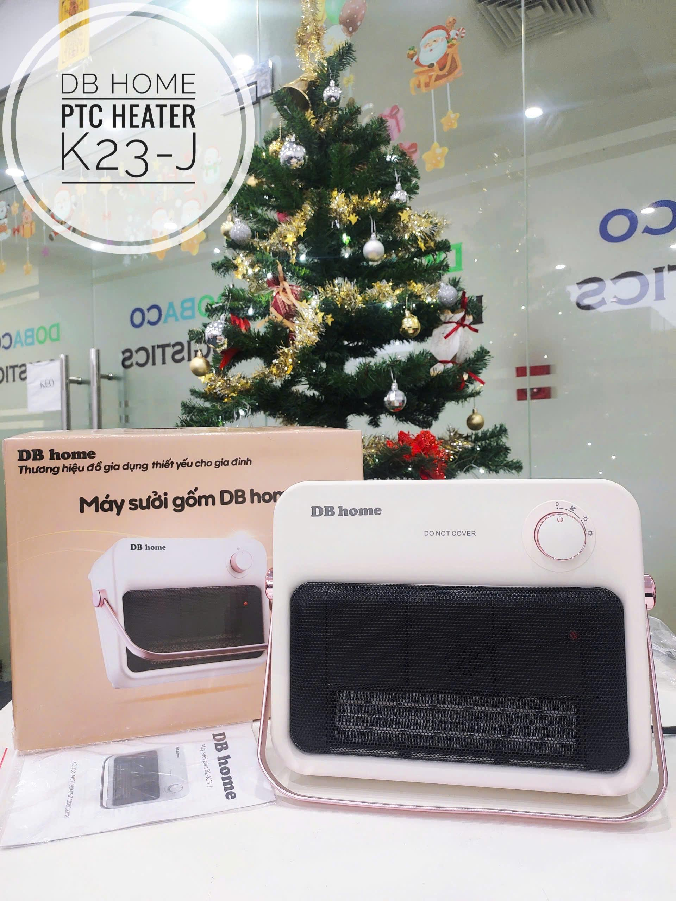
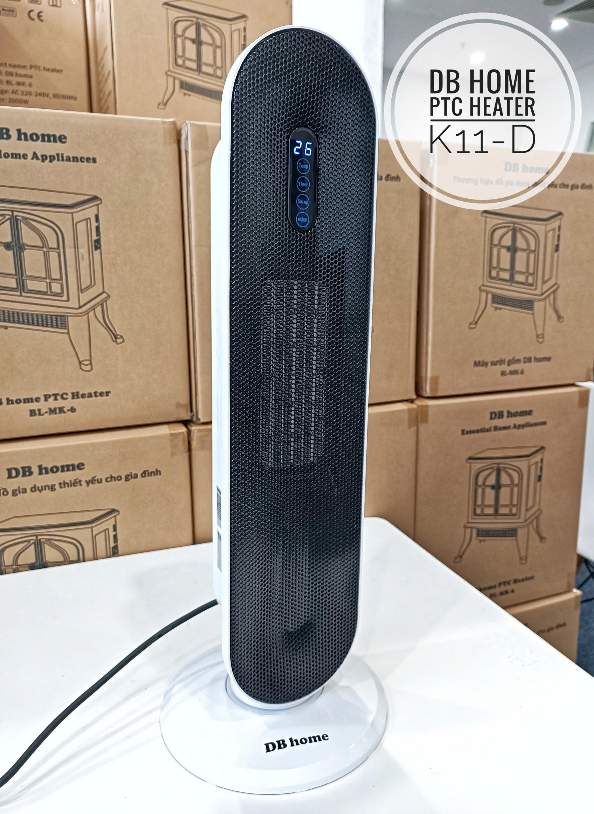

<html lang="vi">
<head>
    <meta charset="UTF-8">
    <meta name="viewport" content="width=device-width, initial-scale=1.0">
    <title>DOBACO LOGISTICS - Tổng Kho Phân Phối Máy Sưởi DB HOME Hải Phòng</title>
    <link href="https://fonts.googleapis.com/css2?family=Inter:wght@400;500;600;700;800&display=swap" rel="stylesheet">
    
    
</head>
<body>

    <header>
        

            <a href="#" class="logo-link">
                
                DOBACO LOGISTICS
            </a>
            <nav>
                <a href="#home">Trang Chủ</a>
                <a href="#products">Sản Phẩm</a>
                <a href="https://zalo.me/0383748395" target="_blank" style="color:var(--primary-green);">Báo Giá Sỉ</a>
            </nav>
        

    </header>

    <section class="hero" id="home">
        

            <h1>TỔNG KHO PHÂN PHỐI MÁY SƯỞI DB HOME CHÍNH HÃNG</h1>
            
Giải pháp sưởi ấm hoàn hảo chuẩn Châu Âu. Nguồn hàng sẵn sàng tại tổng kho Hải Phòng, đáp ứng sỉ/lẻ số lượng lớn với mức chiết khấu tốt nhất.

            <button class="btn-main" onclick="triggerOrder('Tư vấn Báo Giá')">Liên Hệ Báo Giá</button>
        

    </section>

    <section class="products-section" id="products">
        

            <h2 class="section-title">Tổng Kho Sản Phẩm</h2>
            
            

                

                    
                    

                        PHÂN PHỐI SỈ/LẺ SỐ LƯỢNG LỚN
                        <h3 class="product-title">Máy Sưởi Gốm Treo Tường / Để Bàn K23-J</h3>
                        <ul class="product-specs">
                            <li><strong>Công suất:</strong> 1200W - 2000W</li>
                            <li><strong>Bảo hành:</strong> 12 tháng</li>
                            <li>Thiết kế nhỏ gọn, hiện đại, treo tường hoặc để bàn tiện lợi.</li>
                            <li>Công nghệ sưởi gốm êm ái, an toàn, không khô da.</li>
                            <li>Đạt chuẩn Châu Âu (CE, ROHS).</li>
                        </ul>
                        
Giá sỉ cực tốt cho Đại Lý

                        <button class="btn-main" style="width: 100%;" onclick="triggerOrder('Máy Sưởi DB HOME K23-J')">Nhận Báo Giá Zalo</button>
                    

                

                

                    
                    

                        NỘI ĐỊA TRUNG - SẴN KHO
                        <h3 class="product-title">Quạt Sưởi Gốm Dáng Đứng DB HOME K11-D</h3>
                        <ul class="product-specs">
                            <li><strong>Công suất:</strong> 1400W - 2000W</li>
                            <li><strong>Bảo hành:</strong> 12 tháng</li>
                            <li>Kiểu dáng tháp hiện đại, nhỏ gọn, dễ di chuyển.</li>
                            <li>Làm ấm nhanh, KHÔNG đốt oxy, KHÔNG khô da, KHÔNG phát sáng.</li>
                            <li>An toàn tuyệt đối cho người già và trẻ nhỏ.</li>
                        </ul>
                        
Chiết khấu cao đơn hàng sỉ

                        <button class="btn-main" style="width: 100%;" onclick="triggerOrder('Quạt Sưởi DB HOME K11-D')">Nhận Báo Giá Zalo</button>
                    

                

            

        

    </section>

    <footer>
        

            <h4 style="margin-bottom: 5px; color: var(--primary-green);">DOBACO LOGISTICS</h4>
            
© 2026 Bản quyền thuộc về Dobaco Logistics. Vận tải & Phân phối chuyên nghiệp.

        

    </footer>

    

        

            <button class="btn-close" onclick="closeModal()">✕</button>
            <h3 id="modalProductTitle">DOBACO LOGISTICS</h3>
            
Hệ thống đang chuyển hướng bạn đến bộ phận kinh doanh trên Zalo để nhận báo giá sỉ/lẻ và tư vấn vận chuyển.

            <a href="https://zalo.me/0383748395" target="_blank" style="text-decoration: none;">
                <button class="btn-main" style="width: 100%;">Mở Zalo Ngay</button>
            </a>
        

    

    
</body>
</html>
